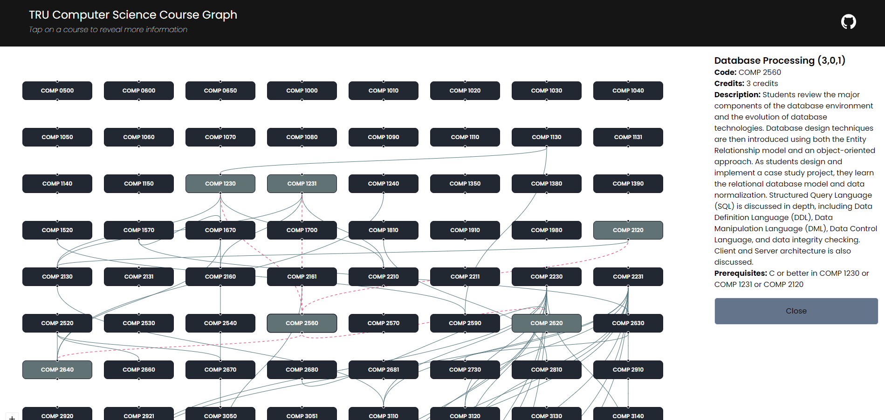

# TRU Computer Science Course Graph

This project is a React application designed to
visualize course data in a graphical format using ReactFlow library.
This app allows users to explore courses and their dependencies through an interactive graph.



## Features

- Visual representation of courses and their dependencies.
- Click on a course node to view its details.
- Toggle visibility of the detail node for a selected course.
- Responsive design for different screen sizes.

## Usage

- Use the mouse to interact with the graph.
- Click on a course node to view its details.
- Toggle visibility of the detail node by clicking on it.
- Explore the graph to understand course dependencies.

## Installation 

1. Clone the repo:
```bash
  git clone https://github.com/voage/TRUCSClassList.git
```
2. Navigate to the project directory & install dependencies:
```bash
  cd course-visualization-app
  npm install
```
3. Run the development server:
```bash 
  npm run dev
```
4.  Open http://localhost:3000 in your browser to view the app.

## Contributing

Contributions are welcome! If you have a feature request, enhancement suggestion, or found a bug, please create an issue first to discuss it.